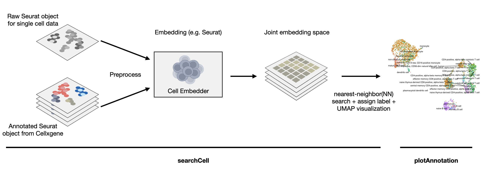

# CellSearchR


CellSearchR is an R package designed to automate the annotation of single-cell RNA-seq data by leveraging the [Cellxgene](https://chanzuckerberg.github.io/cellxgene-census/) database for reference mapping.


## Description

CellSearchR is an R package designed to automate the annotation of single-cell RNA-seq data by leveraging the [Cellxgene](https://chanzuckerberg.github.io/cellxgene-census/) database. CellSearchR is the first R package to use the Cellxgene census database for reference mapping and automatic cell annotation. CellSearchR is designed to be used with R version `4.1.2` on Linux (`Ubuntu 22.04 LTS`).

## Installation
To install the latest version of the package:
    
```r    
install.packages("devtools")
library("devtools")
devtools::install_github("Kuan-Pang/CellSearchR", build_vignettes = TRUE)
library("CellSearchR")
```

To run the shinyApp: Under construction

## Overview

The overview pipeline of CellSearchR is shown below:



`CellSearchR` contains 2 functions:
 - `CellSearchR::searchCell`: This function takes in a query and a reference Seurat object of single cell RNA-seq data, with user specified embedding method. The function then performs reference mapping and returns a list with the query cells annotated with the cell type labels from the reference data.
 - `CellSearchR::plotAnnotation`: Visualize the annotation results from `searchCell()` in a UMAP plot.
 


`CellSearchR` contains 2 datasets:
- `cellxgene3k` is a Seurat object 3K blood cells subsampled from Cellxgene census, which can used as the reference data for `searchCell()`. This dataset is a subset of the [Cellxgene census](https://chanzuckerberg.github.io/cellxgene-census/) database.
- `covid.pbmc3k`  is a Seurat object of 3K PBMCs from a COVID-19 patient, which can be used as the query data for `searchCell()`. This dataset is a subset of [Single cell profiling of COVID-19 patients: an international data resource from multiple tissues](https://www.medrxiv.org/content/10.1101/2020.11.20.20227355v1)


For more information on the usage of the functions, please refer to the [vignette](vignettes/Introduction_CellSearchR.Rmd) for a full tutorial. 


You may also find the information below useful:
```
ls("package:CellSearchR")
data(package = "CellSearchR") 
browseVignettes("CellSearchR")
```


## Contribution

The author for the package is Kuan Pang. The author wrote `searchCell` and `plotAnnotation`. The author curated the datasets of `cellxgene3k` and `covid.pbmc3k`. These two functions utilize the Cellxgene dataset for reference mapping and cell annotation. `searchCell` function implements a customized `Seurat` cell embedding. `plotAnnotation` function visualizes the annotation results in a UMAP plot also with support from `Seurat`. The sample dataset `cellxgene3k` is subsampled from Cellxgene census and preprocessed with `Seurat` and `SeuratDisk`. Another sample dataset `covid.pbmc3k` is processed and downsampled from original publication by Ballestar et al. Generative AI, copilot, was used to assist code writing.

## References

- Chan Zuckerberg Initiative. CZ CELLxGENE Discover. Accessed: insert date here. n.d. url: https://cellxgene.cziscience.com/.

- Yuhan Hao et al. “Integrated analysis of multimodal single-cell data”. In: Cell (2021). doi: 10.1016/j.cell.2021.04.048. url: https://doi.org/10.1016/j.cell.2021. 04.048.

- Ballestar, Esteban, et al. "Single cell profiling of COVID-19 patients: an international data resource from multiple tissues.” medRxiv (2020)." URL https://www.medrxiv.org/content/10.1101/2020.11 20: v1.

- McInnes, Leland, John Healy, and James Melville. "Umap: Uniform manifold approximation and projection for dimension reduction." arXiv preprint arXiv:1802.03426 (2018).

## Acknowledgement
This package was developed as part of an assessment for 2023 BCB410H: Applied Bioinformatics course at the University of Toronto, Toronto, CANADA. `CellSearchR` welcomes issues, enhancement requests, and other contributions. To submit an issue, use the GitHub issues. Many thanks to those who provided feedback to improve this package.

## Future Directions & Roadmaps
- [ ] Add a larger reference datasets to the package
- [ ] Add more visualization options
- [ ] Add more embedding methods to the package (e.g. scVI)
