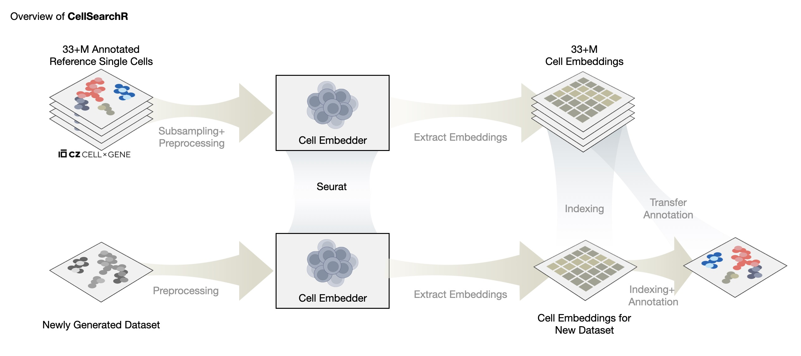

# CellSearchR



CellSearchR is an R package designed to automate the annotation of single-cell RNA-seq data by leveraging the [Cellxgene](https://chanzuckerberg.github.io/cellxgene-census/) database for reference mapping.


## Description
<!--  paragraph that describes the purpose of your R package and biological data being analyzed.
Explain how your package add to or improve a current work flow in bioinformatics or computa-
tional biology (i.e., how is it unique?, what issue does it address?). Finally, include the R version
(not RStudio version) and platform (Mac, Windows, Linux (Debian, Fedora/Redhat, Ubuntu)),
used to develop the package. You may obtain this information by running utils::sessionInfo().
There should be no Shiny implementation at this point -->

CellSearchR is an R package designed to automate the annotation of single-cell RNA-seq data by leveraging the [Cellxgene](https://chanzuckerberg.github.io/cellxgene-census/) database. CellSearchR is unique in that it is the first R package to use the Cellxgene census database for reference mapping and automatic cell annotation. CellSearchR is designed to be used with R version `4.0.2` on Linux (`Ubuntu 22.04 LTS`).

## Installation
To install the latest version of the package:
    
```r    
install.packages("devtools")
library("devtools")
devtools::install_github("Pang-Kuan/CellSearchR", build_vignettes = TRUE)
library("CellSearchR")
```


## Overview
